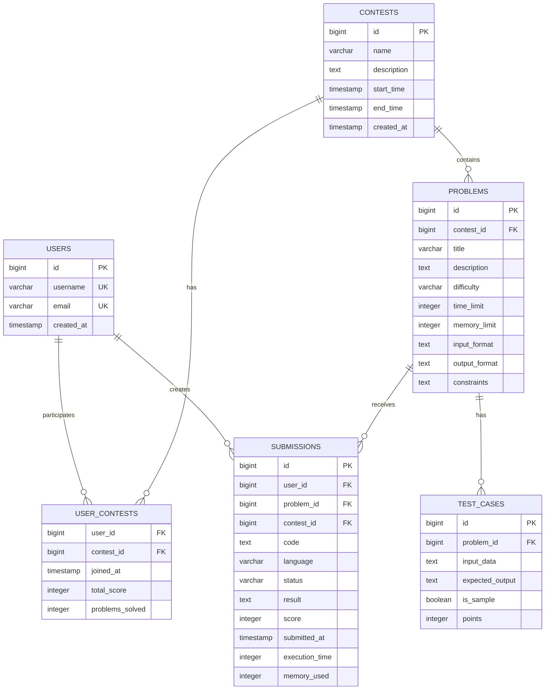
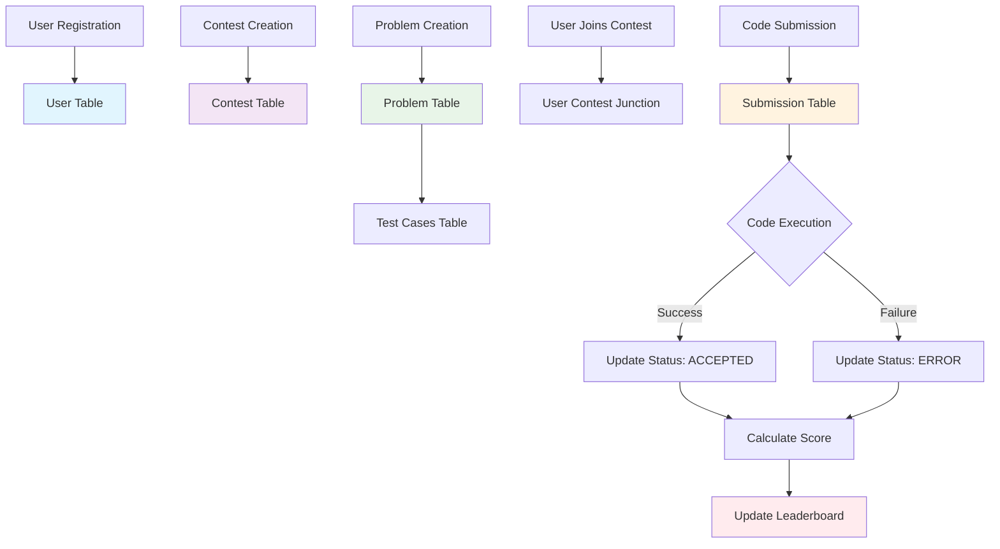

# 🗄️ Database Schema

## Entity Relationship Diagram



## Database Tables

### Users Table
```sql
CREATE TABLE users (
    id BIGSERIAL PRIMARY KEY,
    username VARCHAR(50) NOT NULL UNIQUE,
    email VARCHAR(100) NOT NULL UNIQUE,
    created_at TIMESTAMP NOT NULL DEFAULT CURRENT_TIMESTAMP,
    
    CONSTRAINT chk_username_length CHECK (LENGTH(username) >= 3),
    CONSTRAINT chk_username_format CHECK (username ~ '^[a-zA-Z0-9_]+$'),
    CONSTRAINT chk_email_format CHECK (email ~ '^[a-zA-Z0-9._%+-]+@[a-zA-Z0-9.-]+\.[a-zA-Z]{2,}$')
);

CREATE INDEX idx_users_username ON users (username);
CREATE INDEX idx_users_email ON users (email);
```

### Contests Table
```sql
CREATE TABLE contests (
    id BIGSERIAL PRIMARY KEY,
    name VARCHAR(100) NOT NULL,
    description TEXT,
    start_time TIMESTAMP NOT NULL,
    end_time TIMESTAMP NOT NULL,
    created_at TIMESTAMP NOT NULL DEFAULT CURRENT_TIMESTAMP,
    
    CONSTRAINT chk_time_order CHECK (end_time > start_time),
    CONSTRAINT chk_start_time_future CHECK (start_time >= created_at)
);

CREATE INDEX idx_contests_start_time ON contests (start_time);
CREATE INDEX idx_contests_active ON contests (start_time, end_time) 
    WHERE start_time <= CURRENT_TIMESTAMP AND end_time >= CURRENT_TIMESTAMP;
```

### Problems Table
```sql
CREATE TABLE problems (
    id BIGSERIAL PRIMARY KEY,
    contest_id BIGINT NOT NULL REFERENCES contests(id) ON DELETE CASCADE,
    title VARCHAR(200) NOT NULL,
    description TEXT NOT NULL,
    difficulty VARCHAR(10) NOT NULL CHECK (difficulty IN ('EASY', 'MEDIUM', 'HARD')),
    time_limit INTEGER NOT NULL CHECK (time_limit >= 1),
    memory_limit INTEGER NOT NULL CHECK (memory_limit >= 1),
    input_format TEXT,
    output_format TEXT,
    constraints TEXT
);

CREATE INDEX idx_problems_contest_id ON problems (contest_id);
CREATE INDEX idx_problems_difficulty ON problems (difficulty);
```

### Submissions Table
```sql
CREATE TABLE submissions (
    id BIGSERIAL PRIMARY KEY,
    user_id BIGINT NOT NULL REFERENCES users(id) ON DELETE CASCADE,
    problem_id BIGINT NOT NULL REFERENCES problems(id) ON DELETE CASCADE,
    contest_id BIGINT NOT NULL REFERENCES contests(id) ON DELETE CASCADE,
    code TEXT NOT NULL CHECK (LENGTH(code) >= 1 AND LENGTH(code) <= 50000),
    language VARCHAR(20) NOT NULL CHECK (language IN ('JAVA', 'PYTHON', 'CPP', 'C', 'JAVASCRIPT', 'GO', 'RUST')),
    status VARCHAR(20) NOT NULL DEFAULT 'PENDING' CHECK (status IN ('PENDING', 'RUNNING', 'ACCEPTED', 'WRONG_ANSWER', 'TIME_LIMIT_EXCEEDED', 'MEMORY_LIMIT_EXCEEDED', 'RUNTIME_ERROR', 'COMPILATION_ERROR')),
    result TEXT,
    score INTEGER DEFAULT 0 CHECK (score >= 0),
    submitted_at TIMESTAMP NOT NULL DEFAULT CURRENT_TIMESTAMP,
    execution_time INTEGER CHECK (execution_time >= 0),
    memory_used INTEGER CHECK (memory_used >= 0)
);

CREATE INDEX idx_submissions_user_id ON submissions (user_id);
CREATE INDEX idx_submissions_contest_id ON submissions (contest_id);
CREATE INDEX idx_submissions_status ON submissions (status);
```

## Database Performance Optimizations

### Indexing Strategy
```sql
-- Composite indexes for common query patterns
CREATE INDEX idx_submissions_user_contest ON submissions (user_id, contest_id);
CREATE INDEX idx_submissions_user_problem ON submissions (user_id, problem_id);
CREATE INDEX idx_submissions_contest_problem ON submissions (contest_id, problem_id);

-- Partial indexes for active contests
CREATE INDEX idx_active_contests ON contests (id) 
    WHERE start_time <= CURRENT_TIMESTAMP AND end_time >= CURRENT_TIMESTAMP;

-- Index for leaderboard queries
CREATE INDEX idx_leaderboard ON submissions (contest_id, score DESC, submitted_at ASC) 
    WHERE status = 'ACCEPTED';
```

## Data Flow Diagram


