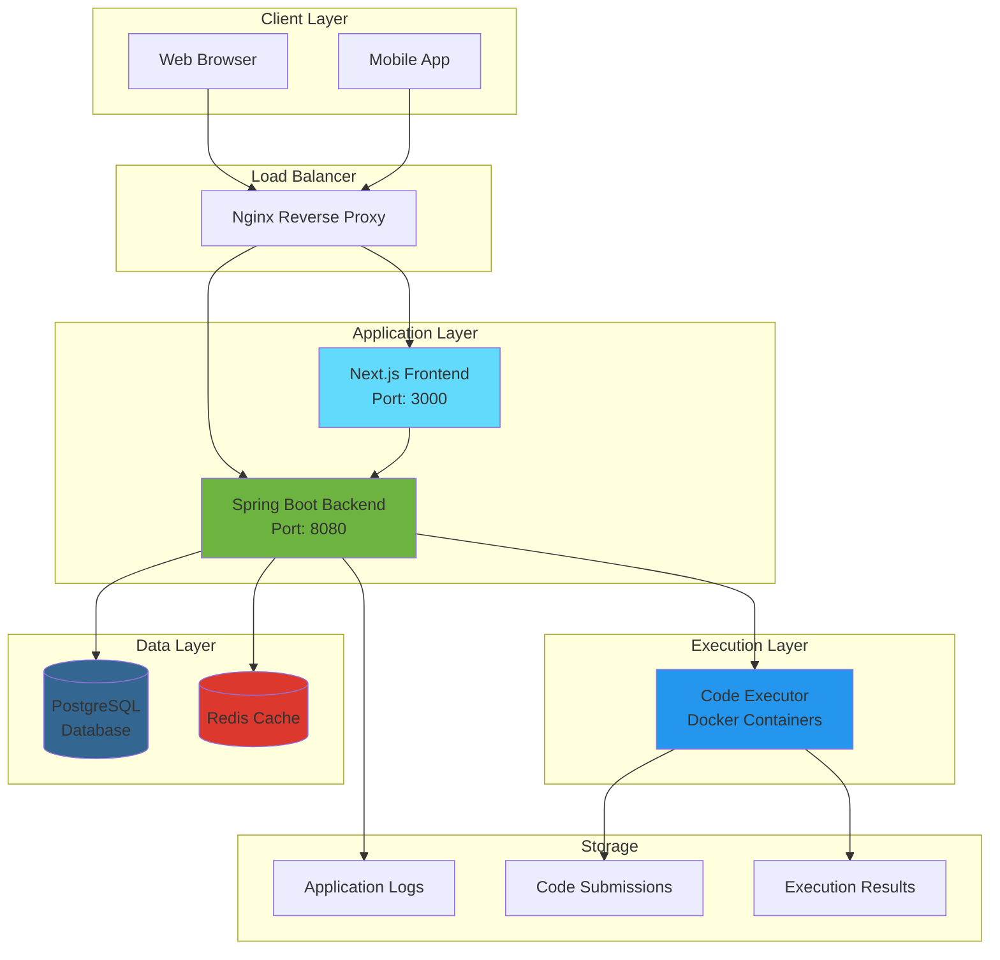
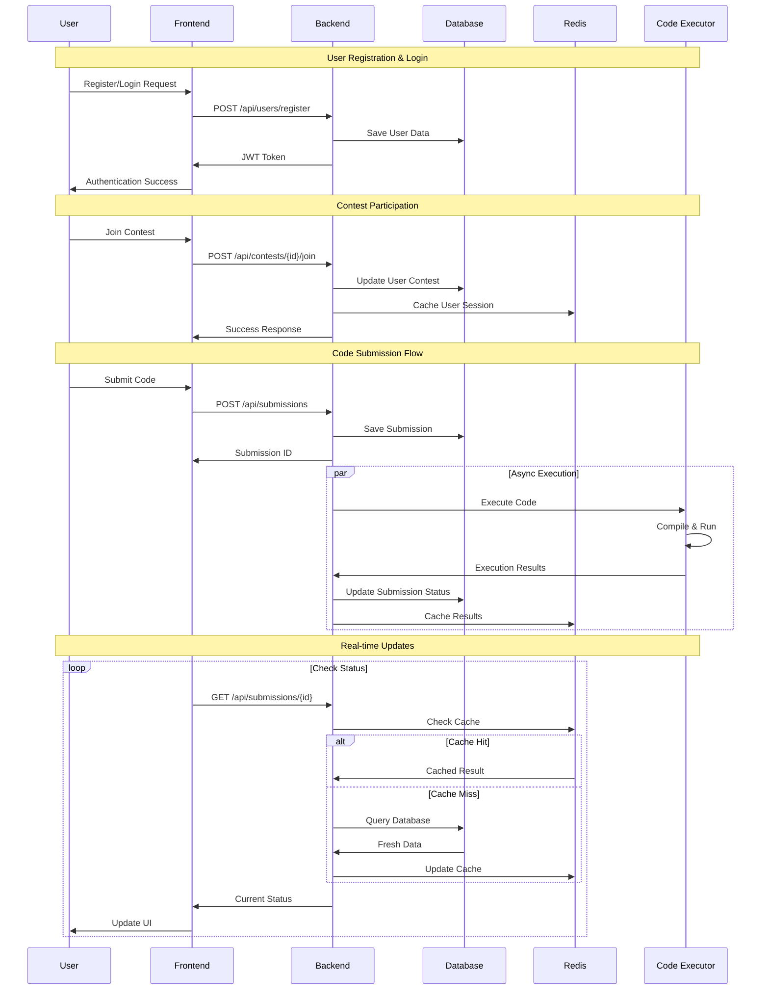
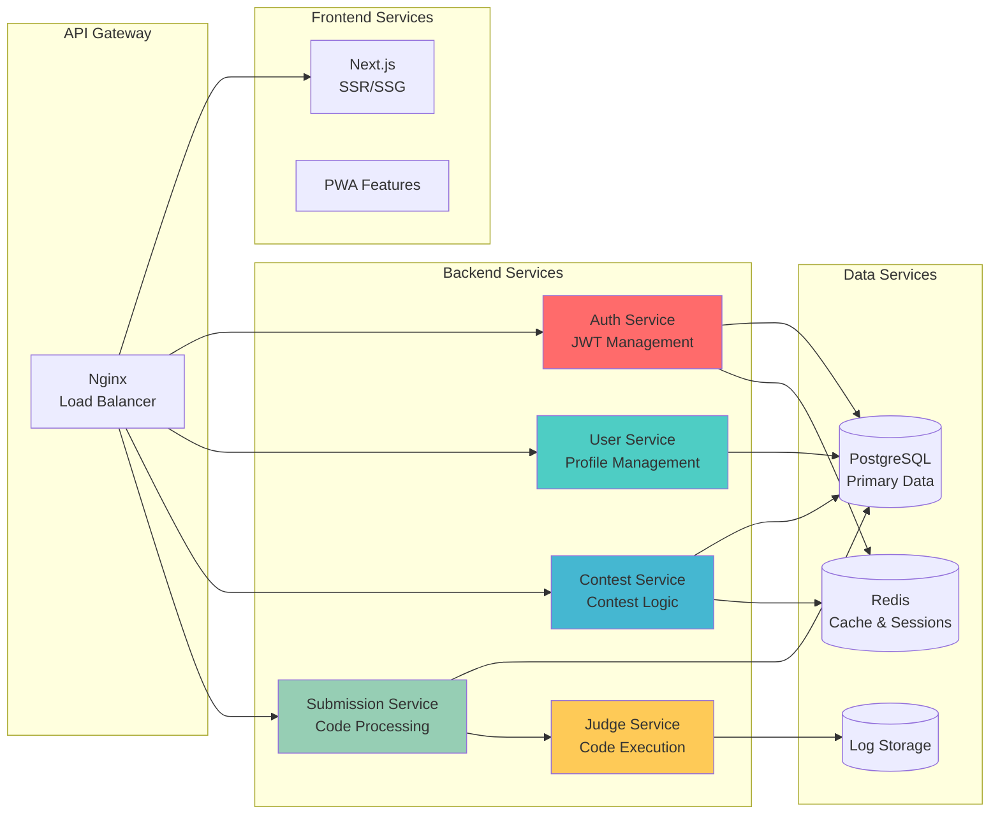
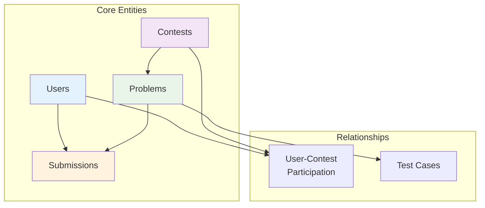
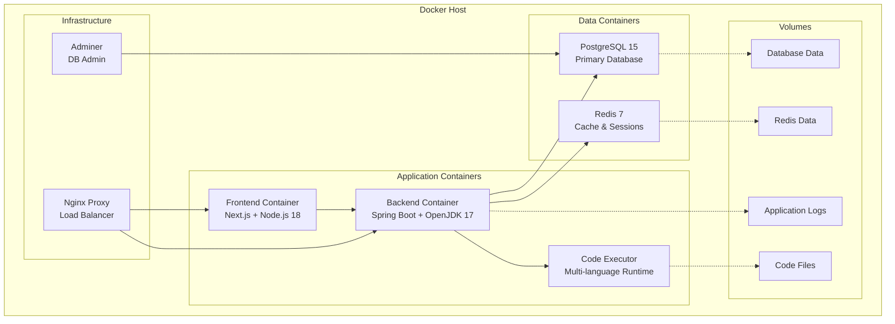
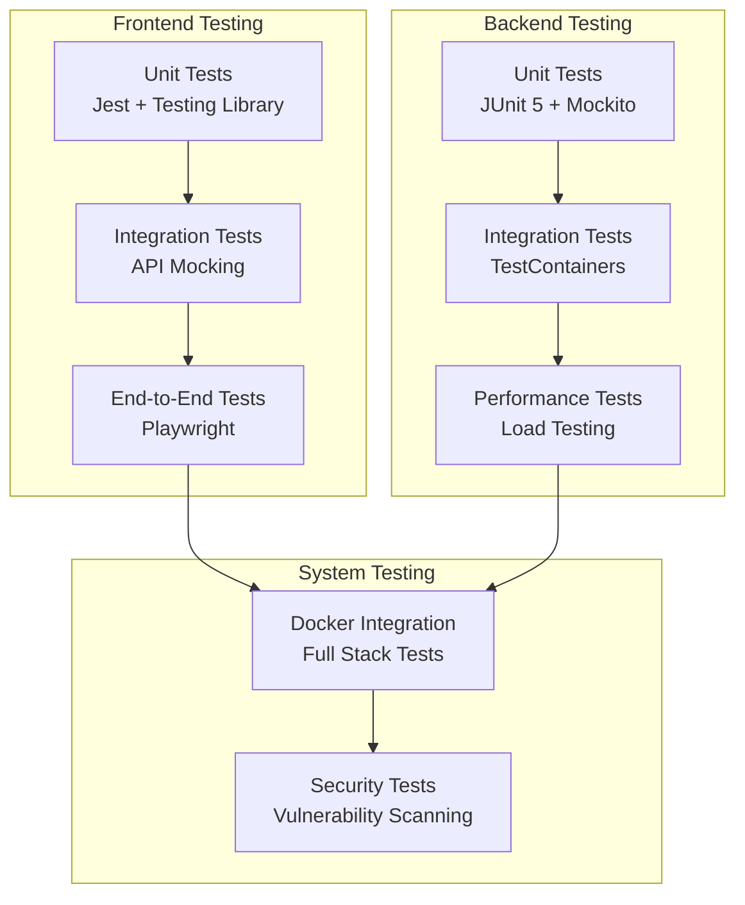
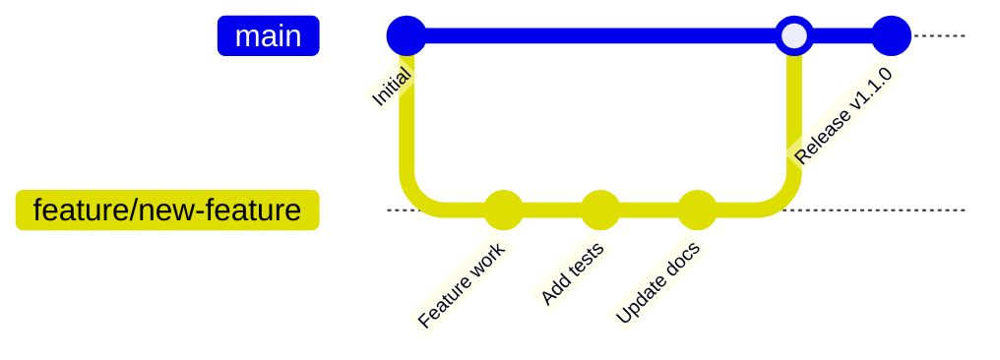

# 🏆 Shodh-a-Code

> A modern, scalable, and secure full-stack coding contest platform built with Spring Boot, Next.js, and PostgreSQL.

[](https://openjdk.java.net/projects/jdk/17/)
[](https://spring.io/projects/spring-boot)
[](https://nextjs.org/)
[](https://www.postgresql.org/)
[](https://www.docker.com/)
[](https://www.typescriptlang.org/)

## 📖 Table of Contents

- [Project Overview](#-project-overview)
- [Features](#-features)
- [System Architecture](#-system-architecture)
- [Technology Stack](#-technology-stack)
- [System Requirements](#-system-requirements)
- [Quick Start](#-quick-start)
- [Setup Instructions](#-setup-instructions)
- [API Documentation](#-api-documentation)
- [Database Schema](#-database-schema)
- [Docker Setup](#-docker-setup)
- [Environment Variables](#-environment-variables)
- [Contributing](#-contributing)
- [Troubleshooting](#-troubleshooting)

## 🎯 Project Overview

The Coding Contest Platform is a comprehensive solution for hosting competitive programming contests. It provides a secure, scalable environment where users can participate in coding competitions, submit solutions in multiple programming languages, and get real-time feedback on their code execution.

### Key Highlights

- **Multi-language Support**: Java, Python, C++, C, JavaScript,
- **Secure Code Execution**: Docker-based sandboxed environment with resource limits
- **Real-time Updates**: Live leaderboards and submission status
- **Modern UI/UX**: Responsive design with dark/light theme support
- **Scalable Architecture**: Microservices-ready with caching and monitoring
- **Production Ready**: Comprehensive Docker setup with CI/CD support

## ✨ Features

### 🔐 User Management

- User registration and authentication
- JWT-based secure sessions
- User profile management
- Contest participation tracking

### 🏁 Contest Management

- Create and manage programming contests
- Time-bound contest execution
- Multi-problem contest support
- Real-time contest status

### 📝 Problem Management

- Rich problem descriptions with examples
- Multiple difficulty levels (Easy, Medium, Hard)
- Configurable time and memory limits
- Test case management

### 💻 Code Submission & Execution

- Multi-language code editor with syntax highlighting
- Secure Docker-based code execution
- Real-time submission status tracking
- Detailed execution results and feedback

### 🏆 Leaderboard & Scoring

- Real-time contest rankings
- Score calculation and tracking
- User submission history
- Performance analytics

### ⚡ Performance Features

- Redis-based caching
- Database connection pooling
- Async submission processing
- Rate limiting and security

## 🏗️ System Architecture

### High-Level Architecture



### Code Flow Diagram



### Microservices Architecture



## 🛠️ Technology Stack

### Backend Technologies

| Technology          | Version | Purpose                                |
| ------------------- | ------- | -------------------------------------- |
| **Java**            | 17 LTS  | Core programming language              |
| **Spring Boot**     | 3.2.0   | Web framework and dependency injection |
| **Spring Security** | 6.x     | Authentication and authorization       |
| **Spring Data JPA** | 3.x     | Database abstraction layer             |
| **PostgreSQL**      | 15+     | Primary database                       |
| **Redis**           | 7+      | Caching and session management         |
| **Flyway**          | 9.x     | Database migration management          |
| **Maven**           | 3.9+    | Build and dependency management        |
| **Docker**          | 24+     | Containerization                       |

### Frontend Technologies

| Technology        | Version | Purpose                      |
| ----------------- | ------- | ---------------------------- |
| **Next.js**       | 14.0+   | React framework with SSR/SSG |
| **React**         | 18.2+   | UI library                   |
| **TypeScript**    | 5.3+    | Type-safe JavaScript         |
| **Tailwind CSS**  | 3.3+    | Utility-first CSS framework  |
| **Framer Motion** | 10.x    | Animation library            |
| **Monaco Editor** | 0.45+   | Code editor component        |
| **React Query**   | 3.39+   | Data fetching and caching    |
| **Zustand**       | 4.4+    | State management             |

### DevOps & Tools

| Technology         | Version | Purpose                         |
| ------------------ | ------- | ------------------------------- |
| **Docker Compose** | 2.x     | Multi-container orchestration   |
| **Nginx**          | Alpine  | Reverse proxy and load balancer |
| **Jest**           | 29.x    | Testing framework               |
| **Playwright**     | 1.40+   | End-to-end testing              |
| **ESLint**         | 8.x     | Code linting                    |
| **Prettier**       | 3.x     | Code formatting                 |

### Code Execution Environment

| Language       | Version | Compiler/Runtime     |
| -------------- | ------- | -------------------- |
| **Java**       | 17 LTS  | OpenJDK 17           |
| **Python**     | 3.11+   | CPython              |
| **C++**        | 20      | GCC 11+              |
| **C**          | 18      | GCC 11+              |
| **JavaScript** | ES2023  | Node.js 18+          |

## 💻 System Requirements

### Development Environment

- **Operating System**: Windows 10/11, macOS 10.15+, or Linux (Ubuntu 20.04+)
- **RAM**: Minimum 8GB, Recommended 16GB+
- **Storage**: 10GB+ free space
- **CPU**: 4+ cores recommended for optimal performance

### Software Prerequisites

- **Docker Desktop**: 4.15+ with Docker Compose V2
- **Node.js**: 18.0+ (for local frontend development)
- **Java**: 17+ (for local backend development)
- **Maven**: 3.9+ (for local backend development)
- **Git**: 2.30+ for version control

### Production Environment

- **CPU**: 4+ cores (8+ recommended)
- **RAM**: 8GB+ (16GB+ recommended)
- **Storage**: 50GB+ SSD
- **Network**: Stable internet connection
- **OS**: Linux (Ubuntu 20.04+ or CentOS 8+)

## 🚀 Quick Start

Get the platform running in under 5 minutes!

### Option 1: Docker Compose (Recommended)

```bash
# Clone the repository
git clone https://github.com/your-org/coding-contest-platform.git
cd coding-contest-platform

# Copy environment configuration
cp docker/environment.example .env

# Start all services
docker-compose up -d

# Check service status
docker-compose ps
```

**Access the application:**

- 🌐 **Frontend**: http://localhost:3000
- 🔧 **Backend API**: http://localhost:8080/api
- 📊 **API Documentation**: http://localhost:8080/api/swagger-ui.html
- 🗄️ **Database Admin**: http://localhost:8081 (Admnr)

### Option 2: Local Development

```bash
# Start database and Redis
docker-compose up -d postgres redis

# Backend setup
cd backend
mvn clean install
mvn spring-boot:run

# Frontend setup (new terminal)
cd frontend
npm install
npm run dev
```

## 📋 Setup Instructions

### Step 1: Clone and Environment Setup

```bash
# Clone the repository
git clone https://github.com/your-org/coding-contest-platform.git
cd coding-contest-platform

# Create environment file
cp docker/environment.example .env

# Edit environment variables (important for security)
nano .env
```

### Step 2: Configure Environment Variables

**Critical security settings:**

```env
# Database (Change for production)
DB_PASSWORD=your_secure_database_password

# JWT Secret (32+ characters)
JWT_SECRET=your-very-secure-jwt-secret-key-minimum-32-characters

# Redis Password
REDIS_PASSWORD=your_secure_redis_password
```

### Step 3: Initialize the Platform

```bash
# Create necessary directories
mkdir -p data/{postgres,redis,submissions,results} logs/backend

# Set proper permissions
chmod -R 755 data logs

# Start the platform
docker-compose up -d
```

### Step 4: Verify Installation

```bash
# Check all services are running
docker-compose ps

# View service logs
docker-compose logs -f backend
docker-compose logs -f frontend

# Test API health
curl http://localhost:8080/api/health
```

### Step 5: Load Sample Data (Optional)

```bash
# The database migrations include sample data
# Check the database for sample contests and problems
docker exec -it coding-contest-db psql -U postgres -d coding_contest_db -c "SELECT * FROM contests;"
```

## 📚 API Documentation

The platform provides a comprehensive REST API for all operations. For detailed API documentation with examples, see [API_DOCUMENTATION.md](API_DOCUMENTATION.md).

**Quick API Access:**

- 📊 **Interactive API Docs**: http://localhost:8080/api/swagger-ui.html (when running)
- 🔧 **OpenAPI Spec**: http://localhost:8080/api/v3/api-docs

### Key Endpoints Summary

| Method | Endpoint                         | Description           |
| ------ | -------------------------------- | --------------------- |
| `POST` | `/api/users/register`            | Register new user     |
| `POST` | `/api/auth/login`                | User authentication   |
| `GET`  | `/api/contests/{id}`             | Get contest details   |
| `POST` | `/api/contests/{id}/join`        | Join contest          |
| `GET`  | `/api/contests/{id}/leaderboard` | Get leaderboard       |
| `POST` | `/api/submissions`               | Submit code           |
| `GET`  | `/api/submissions/{id}`          | Get submission status |

## 🗄️ Database Schema

For complete database schema documentation with ER diagrams, see [DATABASE_SCHEMA.md](DATABASE_SCHEMA.md).

### Database Overview



## 🐳 Docker Setup

### Container Architecture



### Service Configuration

#### Development Profile

```bash
# Start development environment
docker-compose --profile development up -d

# Services included:
# - All core services (frontend, backend, database, redis)
# - Adminer for database management
# - Hot reload enabled for development
```

#### Production Profile

```bash
# Start production environment
docker-compose --profile production up -d

# Services included:
# - All core services with production optimizations
# - Nginx reverse proxy with SSL support
# - Resource limits and health checks
# - Monitoring and logging
```

### Container Specifications

| Container         | Base Image            | CPU Limit | Memory Limit | Purpose                |
| ----------------- | --------------------- | --------- | ------------ | ---------------------- |
| **Frontend**      | `node:18-alpine`      | 0.5 cores | 512MB        | Next.js application    |
| **Backend**       | `openjdk:17-jdk-slim` | 2.0 cores | 2GB          | Spring Boot API        |
| **Database**      | `postgres:15-alpine`  | 1.0 core  | 1GB          | PostgreSQL database    |
| **Redis**         | `redis:7-alpine`      | 0.5 cores | 256MB        | Cache and sessions     |
| **Code Executor** | `ubuntu:22.04`        | 2.0 cores | 2GB          | Multi-language runtime |
| **Nginx**         | `nginx:alpine`        | 0.5 cores | 128MB        | Reverse proxy          |

## 🔧 Environment Variables

### Database Configuration

| Variable      | Default             | Description                                   |
| ------------- | ------------------- | --------------------------------------------- |
| `DB_HOST`     | `localhost`         | Database hostname                             |
| `DB_PORT`     | `5432`              | Database port                                 |
| `DB_NAME`     | `coding_contest_db` | Database name                                 |
| `DB_USERNAME` | `postgres`          | Database username                             |
| `DB_PASSWORD` | `postgres`          | Database password ⚠️ **Change in production** |

### Application Configuration

| Variable          | Default                 | Description                    |
| ----------------- | ----------------------- | ------------------------------ |
| `BACKEND_PORT`    | `8080`                  | Backend server port            |
| `FRONTEND_PORT`   | `3000`                  | Frontend server port           |
| `JWT_SECRET`      | ⚠️ **Required**         | JWT signing secret (32+ chars) |
| `ALLOWED_ORIGINS` | `http://localhost:3000` | CORS allowed origins           |

### Security Configuration

| Variable             | Default         | Description                      |
| -------------------- | --------------- | -------------------------------- |
| `REDIS_PASSWORD`     | ⚠️ **Required** | Redis password                   |
| `RATE_LIMIT_ENABLED` | `true`          | Enable rate limiting             |
| `EXECUTION_TIMEOUT`  | `30`            | Code execution timeout (seconds) |
| `MAX_MEMORY`         | `256`           | Maximum memory limit (MB)        |

### Production Environment Setup

```bash
# Generate secure secrets
export JWT_SECRET=$(openssl rand -base64 32)
export DB_PASSWORD=$(openssl rand -base64 24)
export REDIS_PASSWORD=$(openssl rand -base64 24)

# Create production environment file
cat > .env.production << EOF
JWT_SECRET=${JWT_SECRET}
DB_PASSWORD=${DB_PASSWORD}
REDIS_PASSWORD=${REDIS_PASSWORD}
NEXT_PUBLIC_API_URL=https://api.yourdomain.com
ALLOWED_ORIGINS=https://yourdomain.com
EOF
```

## 🧪 Testing

### Testing Strategy



### CI/CD Pipeline

```yaml
# .github/workflows/deploy.yml
name: Deploy to Production
on:
  push:
    branches: [main]
jobs:
  deploy:
    runs-on: ubuntu-latest
    steps:
      - uses: actions/checkout@v3
      - name: Build and deploy
        run: |
          docker build -t contest-platform .
          docker push registry/contest-platform
```

## 🤝 Contributing

We welcome contributions! Here's how to get started:

### Development Workflow



### Quick Contribution Steps

1. **Fork the repository**

   ```bash
   git clone https://github.com/your-username/coding-contest-platform.git
   cd coding-contest-platform
   ```

2. **Set up development environment**

   ```bash
   cp docker/environment.example .env
   docker-compose --profile development up -d
   ```

3. **Create feature branch**

   ```bash
   git checkout -b feature/your-feature-name
   ```

4. **Make changes and test**

   ```bash
   # Make your changes
   npm test        # Frontend tests
   mvn test        # Backend tests
   ```

5. **Submit pull request**
   - Ensure all tests pass
   - Include documentation updates
   - Follow code style guidelines

### Code Style Guidelines

- **Frontend**: ESLint + Prettier configuration
- **Backend**: Spring Boot conventions + Spotless
- **Database**: Follow naming conventions
- **Documentation**: Update relevant docs

## 🛠️ Troubleshooting

For comprehensive troubleshooting information, see [TROUBLESHOOTING.md](TROUBLESHOOTING.md).

### Quick Fixes

#### Services won't start

```bash
# Check Docker status
docker-compose ps

# View logs
docker-compose logs -f backend

# Reset environment
docker-compose down -v
docker-compose up -d
```

#### Database connection issues

```bash
# Check database health
docker-compose exec postgres pg_isready -U postgres

# Reset database (development only)
docker-compose down -v
docker volume rm coding-contest-platform_postgres_data
```

#### Frontend build issues

```bash
cd frontend
rm -rf .next node_modules
npm install
npm run build
```

## Made by Aaryan Bajaj


